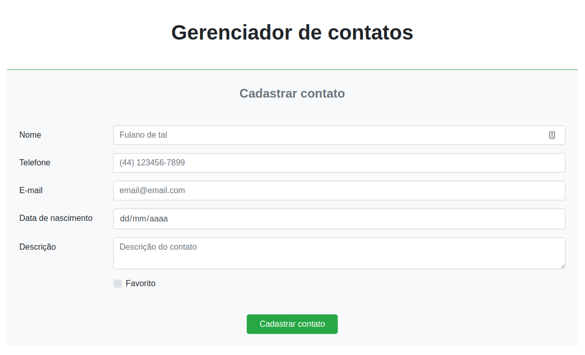
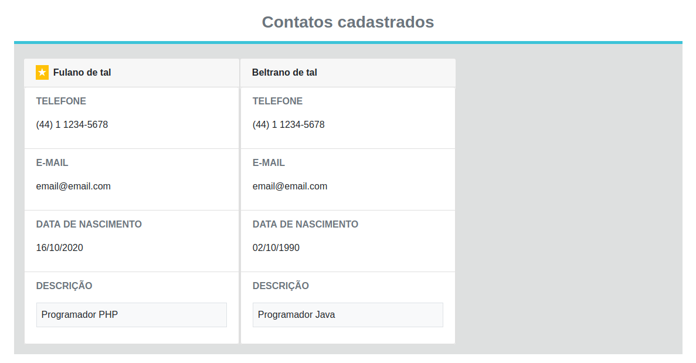

# contatosphp
Uma agenda de contatos local que utiliza o servidor MySQL para armazenamento das informações.

# Funcionalidades
- Design com bootstrap 4
- Armazenamento de nome, telefone e e-mail (facilmente alteráveil)
- Sem dependências externas

# Prévia 

# Instruções

1. Crie uma tabela em um banco de dados MySQL

Crie uma tabela no banco de dados com a estrutura demonstrada [aqui](tabela_contatos.sql).

2. Altere as configurações no arquivo [banco.php](banco.php)

Faça alterações nas linhas de acordo com a configuração do seu servidor.

3. Faça bom proveito!

Se você seguiu as intruções até aqui, sua aplicação deve estar funcionando. Inicie o servidor http e aproveite!